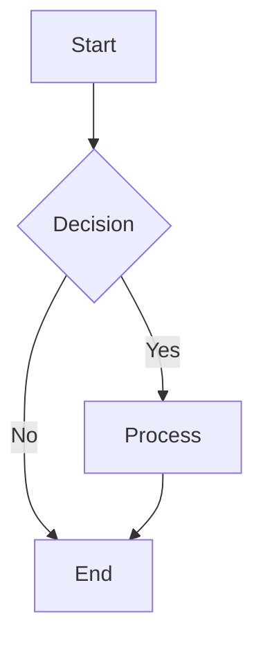
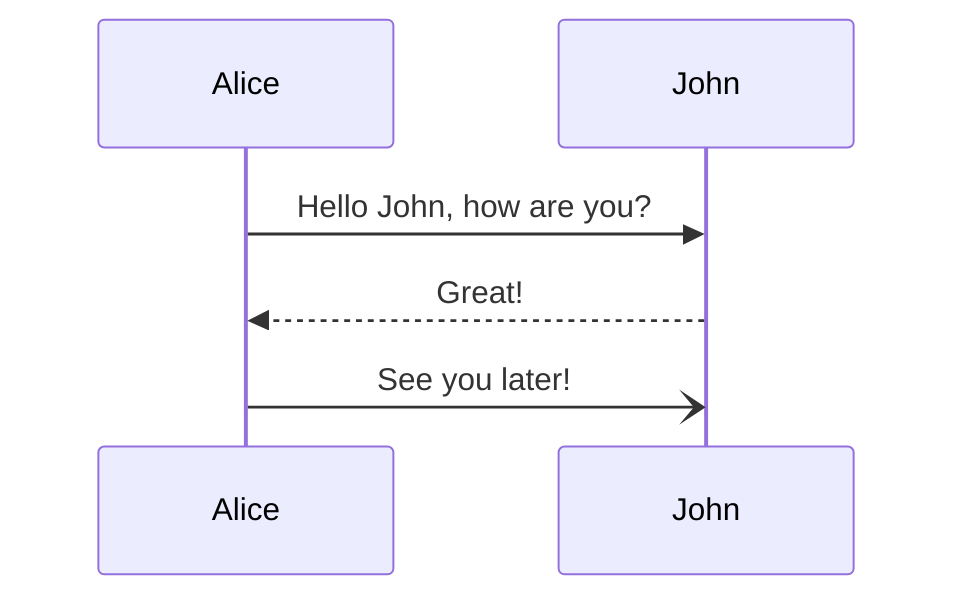

# Comments
<!-- HTML comment -->
[//]: # (This is a Markdown comment)

<!-- prettier-ignore -->
<!-- markdownlint-disable MD013 -->

# Heading 1
## Heading 2
### Heading 3
#### Heading 4
##### Heading 5
###### Heading 6

Heading (setext)
================

Heading (setext) alt
--------------------

# Heading with `code` span
## Heading with **bold** and *italic*

# ── Emphasis & Spans ─────────────────────────────────────────────

*italic* _italic_
**bold** __bold__
***bold italic*** ___bold italic___
~~strikethrough~~
==highlight==
`inline code`
`code with $special chars`
``double-backtick ` code``

# ── Paragraphs & Line Breaks ─────────────────────────────────────

This is a paragraph with **bold**, *italic*, `code`, and a\
line break (backslash). This is a soft break (two trailing spaces followed by newline).  
This is a hard break.

# ── Lists ────────────────────────────────────────────────────────

Unordered:
- Item one
- Item two
  - Nested item
  - Another nested
    - Deeply nested
- Item three

Ordered:
1. First step
2. Second step
   1. Sub-step a
   2. Sub-step b
3. Third step

Task lists:
- [ ] Incomplete task
- [x] Completed task
- [X] Checked task
- [ ] Task with **bold** and `code`

Definition list:
Term A
: Definition of term A

Term B
: First definition
: Second definition

# ── Links & Images ───────────────────────────────────────────────

[Basic link](https://example.com)
[Link with title](https://example.com "Example Site")
[Relative link](../playground/javascript.jsx)
[Reference link][ref]
[Ref shortcut][]
[collapsed][]

[ref]: https://example.com "Reference"
[Ref shortcut]: https://example.com
[collapsed]: https://example.com

<https://autolink.com>
<mailto:user@example.com>
<user@example.com>


![Reference image][img-ref]

[img-ref]: https://example.com/ref.png "Reference Image"

# ── Code Blocks ──────────────────────────────────────────────────

Inline: use `Array.map()` or `Promise.resolve()`.

Indented code block (4 spaces):

    const greeting = 'hello';
    console.log($greeting);

Fenced code block (no language):

```
const data = { key: 'value' };
process(data);
```

Fenced code block (JavaScript):

```javascript
function debounce(fn, delay) {
  let timer;
  return (...args) => {
    clearTimeout(timer);
    timer = setTimeout(() => fn(...args), delay);
  };
}
```

```typescript
interface User {
  name: string;
  age: number;
}
```

```rust
fn fibonacci(n: u32) -> u32 {
  match n {
    0 | 1 => n,
    _ => fibonacci(n - 1) + fibonacci(n - 2),
  }
}
```

```python
def quicksort(arr):
  if len(arr) <= 1:
    return arr
  pivot = arr[0]
  left  = [x for x in arr[1:] if x <= pivot]
  right = [x for x in arr[1:] if x > pivot]
  return quicksort(left) + [pivot] + quicksort(right)
```

```html
<article>
  <h1>Title</h1>
  <p class="content">Hello, world!</p>
</article>
```

```css
.container {
  display: grid;
  grid-template-columns: repeat(3, 1fr);
  gap: 1rem;
}
```

```json
{
  "name": "kanagawa-zed",
  "version": "0.0.2",
  "private": true
}
```

```bash
#!/bin/bash
for file in *.md; do
  echo "Processing $file"
done
```

```diff
- old line
+ new line
```

# ── Blockquotes ──────────────────────────────────────────────────

> Simple blockquote

> Multi-paragraph blockquote.
>
> Second paragraph with `inline code`.

> Nested blockquote:
>
> > Deeply nested quote
> >
> > > Even deeper

> Blockquote with list:
>
> - Item one
> - Item two
>
> And a code block:
>
>     const x = 1;

# ── Tables ───────────────────────────────────────────────────────

| Syntax    | Description |   Score |
| --------- | :---------: | ------: |
| Header    |    Title    |  $100   |
| Paragraph |    Text     |  $200   |
| `code`    |  **bold**   |   $50   |

| Alignment | Left | Center | Right |
|:----------|:----:|:------:|------:|
| Cell      |  1   |   2    |   3   |
| Cell      |  4   |   5    |   6   |

Minimal table:
foo | bar
--- | ---
a   | b
c   | d

# ── Horizontal Rules ─────────────────────────────────────────────

---

***

___

# ── HTML ─────────────────────────────────────────────────────────

<div class="custom">
  <span style="color: red">HTML inside markdown</span>
</div>

<p>Paragraph with <strong>bold</strong> and <em>italic</em>.</p>

This is <span style="color: blue">inline HTML</span> in a paragraph.

<details>
<summary>Click to expand</summary>
Hidden content with **markdown**.
</details>

# ── Footnotes ────────────────────────────────────────────────────

Here is a footnote reference[^1] and another[^2].

[^1]: First footnote definition.
[^2]: Second footnote with **formatting** and `code`.

Longer footnote[^longnote].

[^longnote]: Multi-line footnote
    that continues on the next line.

# ── Front Matter ─────────────────────────────────────────────────

---
title: My Document
description: "A sample markdown file"
author: Pawover
date: 2026-06-26
tags: [markdown, playground, syntax]
draft: false
---

# ── Math ─────────────────────────────────────────────────────────

Inline math: $E = mc^2$ and $\sum_{i=1}^{n} i = \frac{n(n+1)}{2}$

Display math:

$$
\Gamma(z) = \int_0^{\infty} t^{z-1} e^{-t} \, dt
$$

$$
\begin{pmatrix}
a & b \\
c & d
\end{pmatrix}
$$

# ── Escaping ─────────────────────────────────────────────────────

Literal asterisks: \*not italic\*
Literal backticks: \`not code\`
Literal brackets: \[not a link\]
Literal hash: \# not a heading
Literal underscore: \_not emphasis\_

# ── Emoji & Shortcodes ──────────────────────────────────────────

:smile: :rocket: :warning: :100: :fire: :zap:

# ── Special Characters & Entities ────────────────────────────────

&amp; &lt; &gt; &quot; &apos;
&copy; &reg; &trade; &hearts;
&#x2764; &#128640;

# ── Superscript & Subscript ──────────────────────────────────────

H~2~O and 2^10^ = 1024 (if supported by parser)

# ── Linking to Headings ──────────────────────────────────────────

See [Heading 1](#heading-1) or [Code Blocks](#code-blocks).

# ── Abbreviations ────────────────────────────────────────────────

*[HTML]: Hyper Text Markup Language
*[CSS]: Cascading Style Sheets

HTML and CSS are web technologies.

# ── Attributes ───────────────────────────────────────────────────

Some text with a custom class{.custom-class}
Another paragraph with an id{#custom-id}

# ── Mermaid Diagram ──────────────────────────────────────────────





# ── Mixing Everything ────────────────────────────────────────────

> ## Nested heading in blockquote
>
> - List item with `code`
> - Another item with **bold**
>
> ```js
> const x = 42;
> ```
>
> | Col A | Col B |
> |-------|-------|
> | data  | more  |
>
> [Link](#) and  and $x^2$

# ── Raw Block ────────────────────────────────────────────────────

```{=html}
<!-- This is a raw HTML block for pandoc -->
<video src="video.mp4" controls></video>
```

# ── Line Blocks ──────────────────────────────────────────────────

| Line one
| Line two with `code`
| Line three

# ── Grid Tables ──────────────────────────────────────────────────

+----------+----------+
| Header 1 | Header 2 |
+==========+==========+
| Cell A   | Cell B   |
+----------+----------+
| Cell C   | Cell D   |
+----------+----------+
